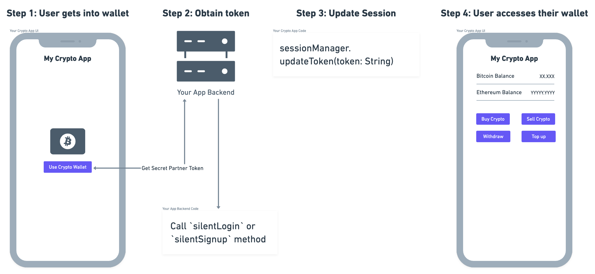
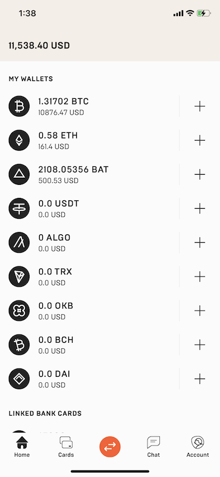
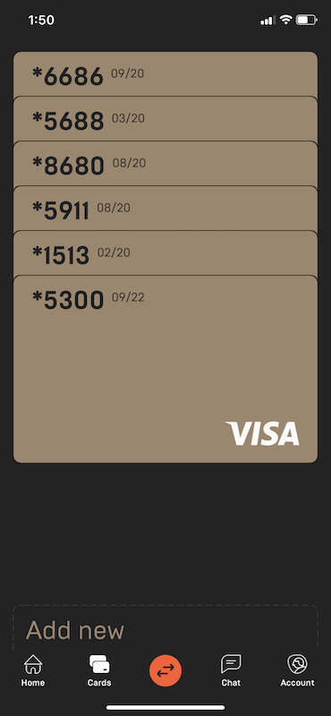

# Quickstart with Mercuryo SDK


## Basics

Mercuryo is a Multicurrency Crypto Wallet allowing users to buy, sell, store and pay with cryptocurrency whenever they want. Besides client-facing web and mobile apps or widgets Mercuryo provides the platform for developers to create their own services on top of our API. This SDK is created to ease the process of integration of top-notch crypto experince to your mobile applications.

Main features of SDK include:
- silently logging user in
- explicilty log user in
- explicilty sign user up using different credentials
- getting user's wallets and balances
- getting actual exchange rates
- getting user's cards
- allowing user to bind new cards
- allowing user to buy, sell crypto using added cards
- allowing user to withdraw and top up crypto using generated addresses.

To integrate Mercuryo Mobile SDK you'd need to contact us and get a unique partner token which will need to be integrated on your backend. This token must be obtained by your mobile application for silent login from the server in secure manner.

## Installation

SDK currently is publicly available for Android while being in closed Beta for iOS. Follow steps below to install it for your Android application.

### Gradle

Add it in your root build.gradle at the end of repositories:

```Kotlin
allprojects {
    repositories {
        ...
        maven { url 'https://dl.bintray.com/andrey-timofeev/mercuryo/' }
    }
}
```

Add dependency:

```Kotlin
dependencies {
    implementation 'com.github.adaptyteam:AdaptySDK-Android:0.3.1'
}
```

## Server Integration

To operate on behalf of the user your app needs to create session providing access token. This token is expected to be obtained from server-to-server communication between your backend application and Mercuryo API.

The API method for silent login receives the following parameters:
- `partner_token` - unique partner token
- `user_phone` - user's phone number with country code.

The method checks whether partner_token is valid, user with specified user_phone exists and allowed to log in.

Read more about server-to-server communication [here].(silent_login.md) 

If all the conditions are met the method logs user in and issues an `access_token` in the response which should be passed to SDK.

General data flow is shown below:



To initialize the session with Access Token use the following:

```kotlin
val mercuryo: Mercuryo = Mercuryo.create(...)  
val sessionManager: SessionManager = mercuryo.session
sessionManager.updateToken(token: String)
```

## Debugging

To debug methods using SDK you'd need:
- add Napier logger library (Read more at https://github.com/AAkira/Napier)
– add `isDebug` parameter in `.create` method:

```kotlin
Mercuryo.create(application: Application,
    baseHost: String? = null,
    isDebug: Boolean = true
)
```

## Wallets



Mercuryo user has several wallets for each crypto currency with a correspondent balance. You may decide yourself which wallet is shown or hidden but these methods allow you to get whole state of user's balances.

```kotlin
val wallet = mercuryo.wallet
wallet.getWallets(): List<Wallet>
wallet.getTransactions(type: TransactionType?, limit: Int, offset: Int, currency: String?): List<Transaction> 
```

## Operations

For buying and selling crypto on behalf of the user you should perform the following steps:
- initialize buying or selling session
- provide currencies, amount, fix rate by obtaining so-called buying or selling token which is valid for several minutes
- make transaction providing card id, card CVV
- if needed, ask for additional verification, i.e. descriptor code.

For example, the following methods may be used for buying crypto providing user's card:

```kotlin
val mercuryo: Mercuryo = Mercuryo.create(...)  
val buy: Buy = mercuryo.operations.buy
buy.convert(fromCurrency: String, toCurrency: String, amount: String)
buy.commit(cardId: String, cvv: String, buyToken: String, redirectUrl: String)
```

## Cards

Mercuryo stores user's encrypted cards data allowing users to buy and sell using them.



To get a list of linked cards, call the method:

```kotlin
cardManager.getCards(limit: Int, offset: Int): List<Card>
```

Use the following method to add a card to user's account:

```kotlin
cardManager.bindCard(holderName: String, number: String, cvv: String, expirationMonth: String, expirationYear: String, redirectUrl: String): BindCard
```

## SDK models reference

Read more regarding SDK models in our [SDK Models Reference](models.md#models)

## Roadmap

## Updates and support

If you have any questions or suggestions please create an issue in GitHub, write us in Telegram (https://t.me/mercuryo_en) or in Intercom on our website (https://help.mercuryo.io/).