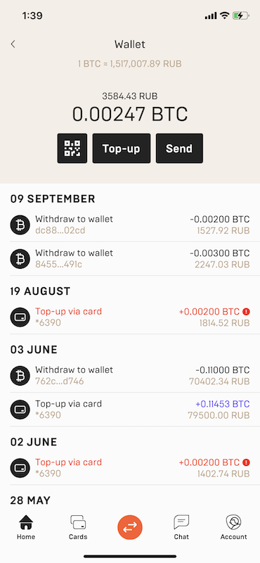

*All methods imply that you've called `updateToken` method*

# Wallets

`Wallet` object needs to be obtained first to get any info about wallets of user:


```kotlin
val mercuryo = Mercuryo.create(...)
val wallet = mercuryo.wallet
```

## Available balances

```kotlin
wallet.getWallets(): List<Wallet>
```


## Getting address of wallet

Let user top up specific wallet proviging an address.

```kotlin 
wallet.getWalletsAddress(crypto: String): String
```

## Getting transactions of wallet

```kotlin
wallet.getTransactions(type: TransactionType?, limit: Int, offset: Int, currency: String?): List<Transaction> 
```



Filters are available for the wallet:
* `type` - [`TransactionType`](http://gitlab.4taps.me/yablokoff/mercuryo-sdk-common/wikis/%D0%9C%D0%BE%D0%B4%D0%B5%D0%BB%D0%B8#transactiontype), if `type == null` is passed then transactions of all available types are returned;
* `limit` - max amount of transations, default is 20;
* `offset` - offset from the start;
* `currency` - filter by crypto, the following choices are available: (`BTC`,`ETH`,`BAT`,`USDT`,`ALGO`,`TRX`,`OKB`,`BCH`,`DAI`), if `currency == null` is passed then transactions of all currencies are returned.
***
